# 📊 Sensores de Presión - Configuración y Especificaciones

## 📋 Tabla Comparativa de Sensores

| Sensor | Estado | Protocolo | Rango de Presión | Temperatura | Resolución | Precisión | Frecuencia | Vista Superior | Vista Lateral |
|--------|--------|-----------|------------------|-------------|------------|-----------|------------|----------------|---------------|
| **[SSCDANN600MDSA3-ND](#-sscdann600mdsa3-nd)** | ✅ | SPI | ±60 kPa | -20 a 85°C | 12 bits | ±2% FS | ~2.17 kHz | 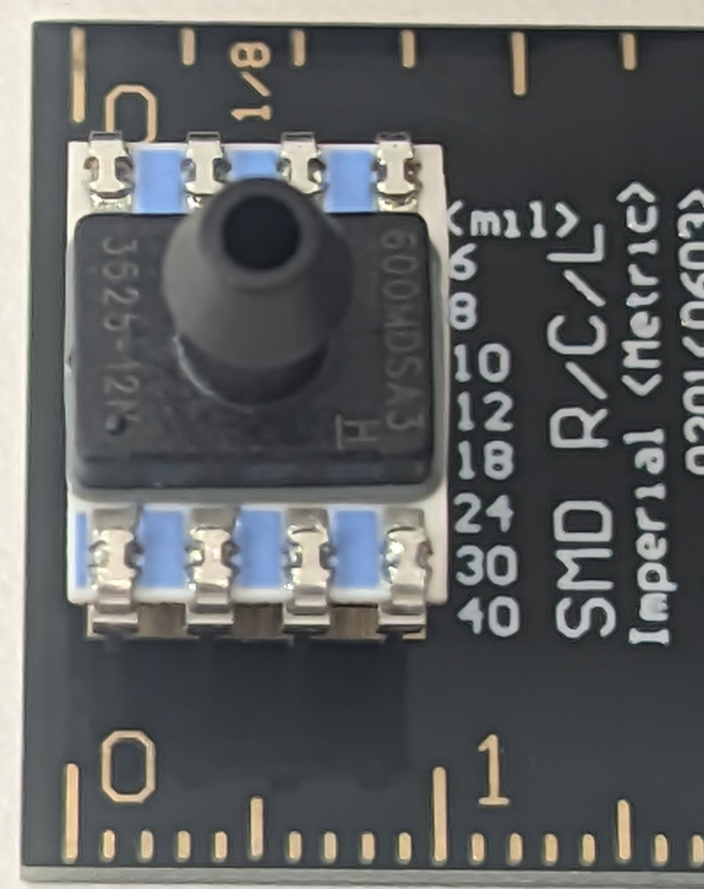 | 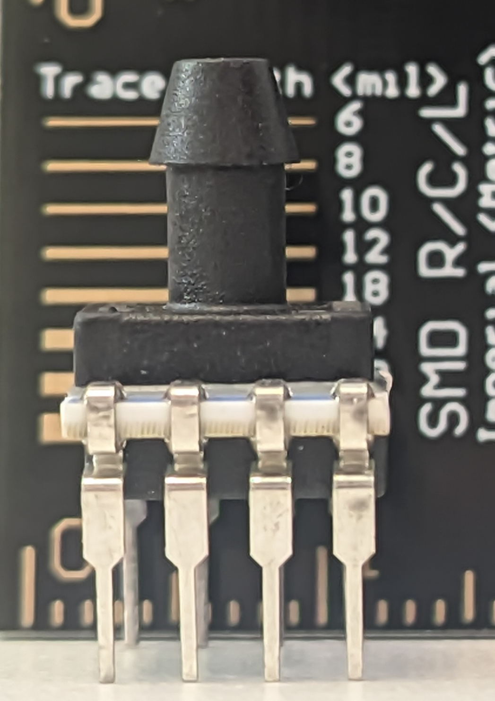 |
| **[ELVH-015D-HAND-C-P2A4](#-elvh-015d-hand-c-p2a4)** | ✅ | I2C (0x28) | ±103 kPa | 0 a 50°C | 14 bits | ±0.5% FS | ~2.17 kHz | 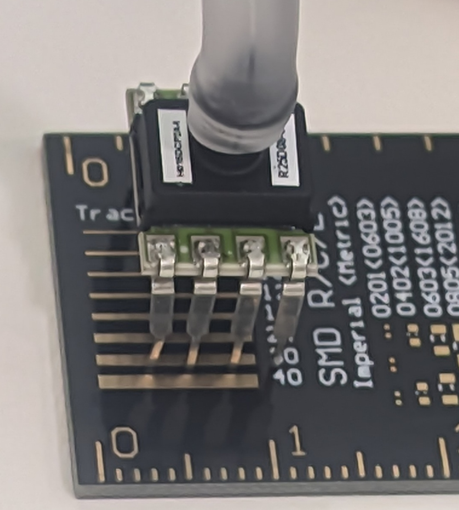 | 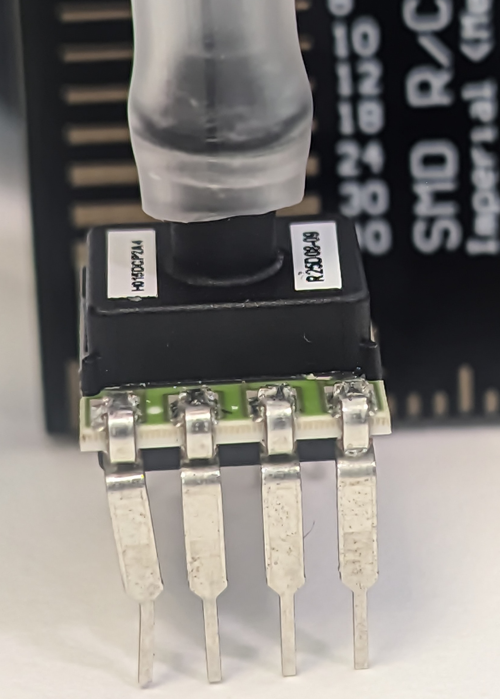 |
| **[SM4291-HGE-S-500-000](#-sm4291-hge-s-500-000)** | 🔄 | I2C (0x6D) + Analógico | 0 a 172 kPa ⚠️ | -20 a 85°C | 16 bits (I2C) | ±1% FS (A) / ±1.5% FS (D) | 2 kHz |  | 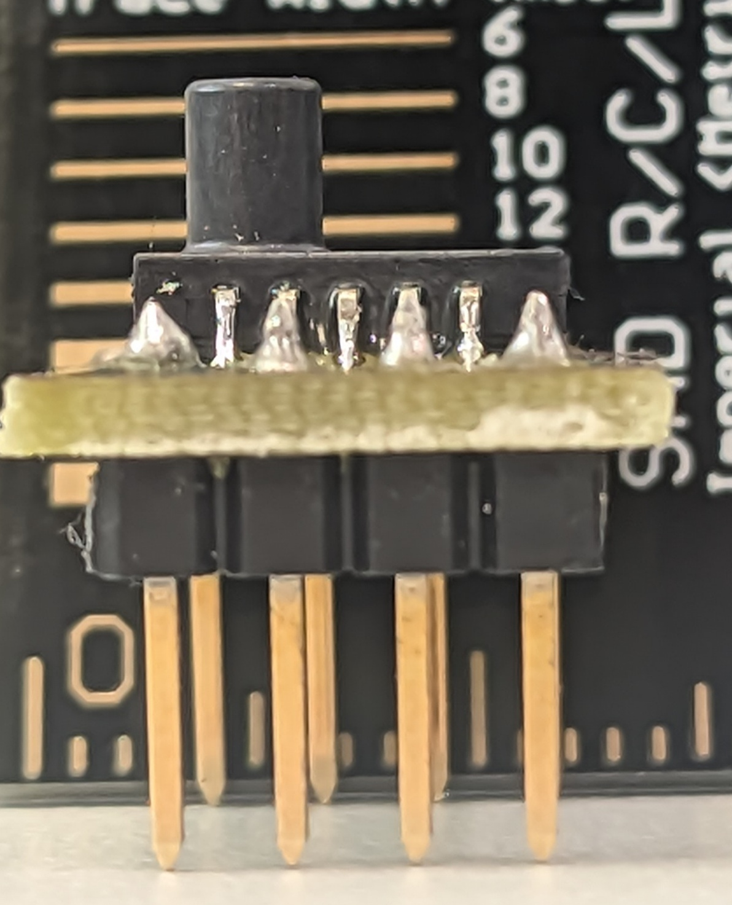 |
| **[2SMPP-02](#-2smpp-02)** | ⚠️ | Analógico | 0 a 37 kPa | 0 a 50°C | Analógico | 0.8% FS | N/A | 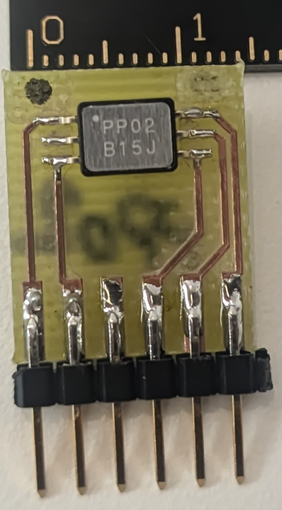 | 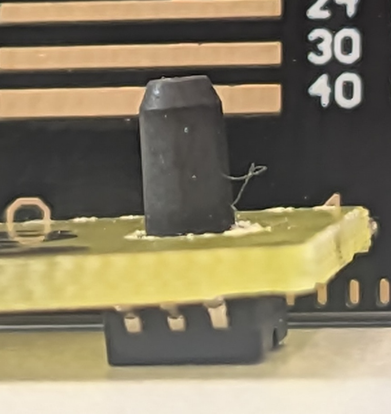 |
| **[2SMPP-03](#-2smpp-03)** | ⚠️ | Analógico | ±50 kPa | 0 a 85°C | Analógico | ±0.8% FS | N/A | 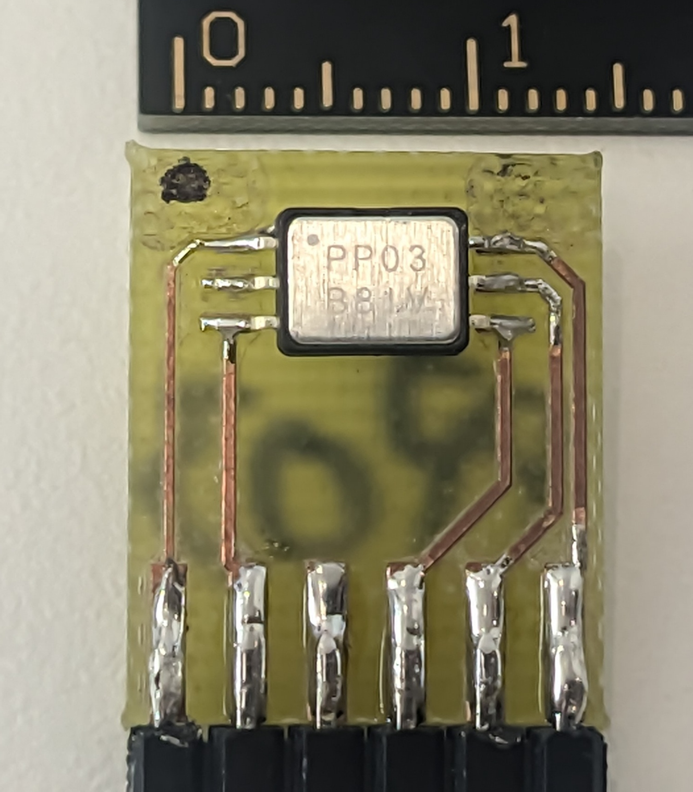 | 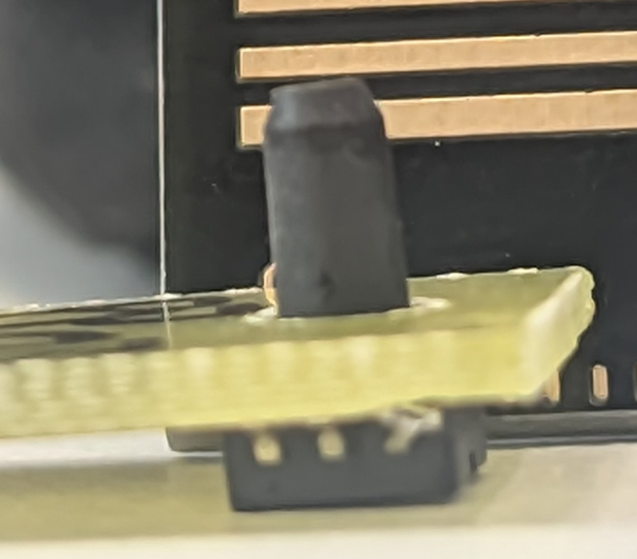 |
| **[ABPLLNV600MG0S3](#-abpllnv600mg0s3)** | ✅ | I2C (0x08) | 0 a 60 kPa | 0 a 50°C | 14 bits | ±1.5% FS | 2 kHz | 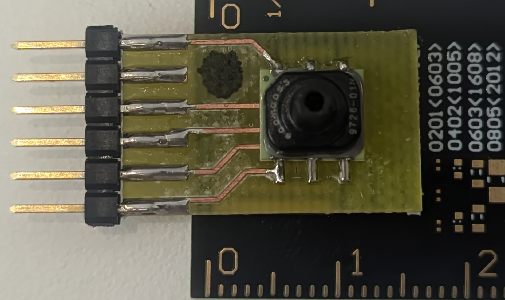 | 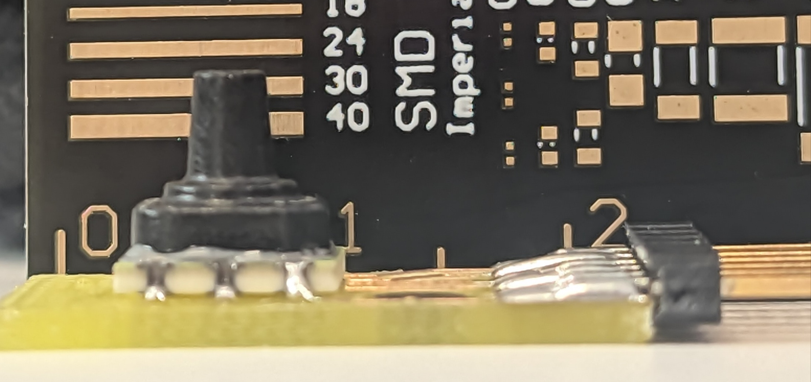 |

**Leyenda:**
- ✅ **Funcionando:** Sensor probado y operativo
- ⚠️ **Parcialmente funcional:** Requiere ajustes o presenta limitaciones
- 🔄 **En evaluación:** Estado por determinar
- **FS:** Full Scale (Escala completa)
- **A:** Analógico, **D:** Digital

---

## 🔧 SSCDANN600MDSA3-ND

**Estado:** ✅ **Funcionando** (PIN 0 se ve con el punto hacia arriba)

**Protocolo:** SPI (Estándar Honeywell)

### 📌 Pinout:
| Pin | Función | Descripción |
|-----|---------|-------------|
| 1 | GND | Tierra |
| 2 | Vsupply | Alimentación |
| 3 | MISO | Master In, Slave Out |
| 4 | SCLK | Serial Clock |
| 5 | SS | Slave Select |

### 📊 Especificaciones Técnicas:
- **Temperatura:** -20 a 85°C
- **Rango de presión:** ±60 kPa (±600 mbar)
- **Resolución:** 12 bits (comunicación de 14 bits)
- **Precisión:** ±2% FS
- **Estabilidad a largo plazo:** ±0.25% (1000 hrs)
- **Tiempo de respuesta:** 0.46 ms
- **Frecuencia de muestreo:** ~2 kHz

### 📚 Documentación:
- **Hoja de datos:** [SSC Series Datasheet](ssc_series_DS.pdf)
- **Función de transferencia:** Página 11 del datasheet
- **Comunicación SPI:** [Honeywell SPI Communication](sps-siot-spi-comms-digital-ouptu-pressure-sensors-tn-008202-3-en-ciid-45843.pdf)

---

## 🔧 ELVH-015D-HAND-C-P2A4

**Estado:** ✅ **Funcionando**

**Protocolo:** I2C

**Dirección I2C:** 0x28

### 📌 Pinout:
| Pin | Función | Descripción |
|-----|---------|-------------|
| 1 | GND | Tierra |
| 2 | VS | Alimentación |
| 3 | SDA | Serial Data (pull-up 1kΩ) |
| 4 | SCL | Serial Clock (pull-up 1kΩ) |

### 📊 Especificaciones Técnicas:
- **Temperatura:** 0 a 50°C
- **Rango de presión:** -103 a 103 kPa (±15 psi)
- **Resolución:** 14 bits reales
- **Precisión:** ±0.5% FS
- **Tiempo de respuesta:** 0.46 ms
- **Frecuencia de muestreo:** ~2.17 kHz

### 📚 Documentación:
- **Hoja de datos:** [ELV Series Datasheet](ELV_Series.pdf)

---

## 🔧 SM4291-HGE-S-500-000

**Estado:** ✅ **Funcionando**

**Protocolo:** I2C + Analógico

**Dirección I2C:** 0x6D

### 📌 Pinout:
*Referencia: Pin 1 arriba a la izquierda con entrada de presión hacia abajo*

| Pin | Función | Descripción |
|-----|---------|-------------|
| 1 | NC | No conectar |
| 2 | SCL | Serial Clock (pull-up 4.7kΩ) |
| 3 | SDA | Serial Data (pull-up 4.7kΩ) |
| 4-6 | NC | No conectar |
| 7 | GND | Tierra (pin 5 en breakout) |
| 8 | NC | No conectar |
| 9 | Analog Out | Salida analógica |
| 10 | Power | Alimentación |

### 📊 Especificaciones Técnicas:
- **Temperatura:** -20 a 85°C
- **Rango de presión:** 0 a 172 kPa (25 psi)
- **Resolución:** 16 bits (I2C), 10-90% Vdc (analógico)
- **Precisión:** 
  - Digital: ±1.5% FS
  - Analógico: ±1% FS
- **Frecuencia de muestreo:** 2 kHz

### 📚 Documentación:
- **Hojas de datos:** 
  - [SM4291 Datasheet PDF](SM4291-HGE-S-500-000.PDF)
  - [Product Datasheet](product-4291-HGE-S-500-000.datasheet.pdf)
  - [SM4000/SM1000 Pressure Sensor Datasheet](SM4000_SM1000-pressure-sensor-AMSYS-datasheet.pdf)

---

## 🔧 2SMPP-02

**Estado:** ⚠️ **Funciona con voltajes muy pequeños**

**Protocolo:** Salida analógica

**Dirección I2C:** N/A

### 📌 Pinout:
*Referencia: Pin 1 arriba a la izquierda*

| Pin | Función | Descripción |
|-----|---------|-------------|
| 1 | Vout + | Salida positiva |
| 2 | NC | No conectar (GND en breakout) |
| 3 | GND | Tierra |
| 4 | Vout - | Salida negativa |
| 5 | N-sub | Substrato N |
| 6 | Icc | Corriente de alimentación |

### 📊 Especificaciones Técnicas:
- **Temperatura:** 0 a 50°C
- **Rango de presión:** 0 a 37 kPa
- **Voltaje de offset:** -2.5 ± 4 mV
- **Voltaje de span:** 31.0 ± 3.1 mV
- **No linealidad:** 0.8% FS máx.
- **Histéresis:** 0.5% FS
- **Influencia térmica (span):** ±1.0% FS
- **Influencia térmica (offset):** ±3.0% FS

#### Influencia de temperatura detallada:
- **Span:**
  - 0°C: 0.5 ± 1.0% FS
  - 50°C: 0.3 ± 1.0% FS
- **Offset:**
  - 0-25°C: 0 ± 3.0% FS
  - 25-50°C: 0 ± 3.0% FS

### 📚 Documentación:
- **Hoja de datos:** [2SMPP-02 Datasheet](en-2smpp-02.pdf)

---

## 🔧 2SMPP-03

**Estado:** ⚠️ **Funciona como el 2SMPP-02**

**Protocolo:** Salida analógica

**Dirección I2C:** N/A

### 📌 Pinout:
*Referencia: Pin 1 arriba a la izquierda*

| Pin | Función | Descripción |
|-----|---------|-------------|
| 1 | Vout + | Salida positiva |
| 2 | NC | No conectar (GND en breakout) |
| 3 | GND | Tierra |
| 4 | Vout - | Salida negativa |
| 5 | N-sub | Substrato N |
| 6 | Icc | Corriente de alimentación |

### 📊 Especificaciones Técnicas:
- **Temperatura:** 0 a 85°C
- **Rango de presión:** -50 a 50 kPa
- **Voltaje de offset:** -2.5 ± 4 mV
- **Voltaje de span:** ±42.0 mV (típico)
  - Positivo: 42.0 mV
  - Negativo: -43.0 mV
- **Resistencia del puente:** 20.0 kΩ típica (18.0-22.0 kΩ)
- **Corriente de alimentación:** 100 μA típica
- **No linealidad:** ±0.8% FS máx.
- **Histéresis:** ±0.2% FS

#### Influencia de temperatura detallada:
- **Span:**
  - 0°C: ±1.0% FS (pos.), ±0.8% FS (neg.)
  - 50°C: ±1.0% FS (pos.), ±0.1% FS (neg.)
  - 85°C: ±1.0% FS (pos.), ±1.2% FS (neg.)
- **Offset:**
  - 0°C: ±3.0% FS
  - 50°C: ±3.0% FS
  - 85°C: ±5.0% FS

**Notas:** Funciona similar al 2SMPP-02. Es un tema de hardware - al final es solo voltaje analógico.

### 📚 Documentación:
- **Hoja de datos:** [2SMPP-03 Datasheet](en-2smpp-03.pdf)

---

## 🔧 ABPLLNV600MG0S3

**Estado:** 🔄 **En evaluación**

**Protocolo:** I2C

**Dirección I2C:** 0x08

### 📌 Pinout:
*Referencia: Pin 1 diagonal*

| Pin | Función | Descripción |
|-----|---------|-------------|
| 1 | GND | Tierra |
| 2 | Vs | Alimentación |
| 3 | INT | Interrupción |
| 4 | NC | No conectar |
| 5 | SDA | Serial Data |
| 6 | SCL | Serial Clock |

### 📊 Especificaciones Técnicas:
- **Temperatura:** 0 a 50°C (calibrado)
- **Rango de presión:** 0 a 60 kPa (0 a 600 mbar, gauge)
- **Resolución:** 14 bits reales (10 a 90%)
- **Precisión:** ±1.5% FS
- **Frecuencia de muestreo:** 2 kHz

### 📚 Documentación:
- **Hoja de datos:** [Basic Board Mount Pressure Sensors ABP Series](HWSC-S-A0013047928-1.pdf)

---

## 📚 Documentación Adicional

### Otros Datasheets Disponibles:
- [PF1550 Datasheet](PF1550.pdf)

---

## 📊 Análisis Comparativo

### Mejor Precisión:
1. **ELVH-015D-HAND-C-P2A4:** ±0.5% FS
2. **2SMPP-02/03:** ±0.8% FS
3. **SM4291 (Analógico):** ±1% FS
4. **SM4291 (Digital) / ABPLLNV600MG0S3:** ±1.5% FS
5. **SSCDANN600MDSA3-ND:** ±2% FS

### Mayor Rango de Presión:
1. **ELVH-015D-HAND-C-P2A4:** 206 kPa (rango total)
2. **SM4291-HGE-S-500-000:** 172 kPa
3. **SSCDANN600MDSA3-ND:** 120 kPa (rango total)
4. **2SMPP-03:** 100 kPa (rango total)
5. **ABPLLNV600MG0S3:** 60 kPa
6. **2SMPP-02:** 37 kPa

### Mayor Resolución:
1. **SM4291 (I2C):** 16 bits
2. **ELVH-015D-HAND-C-P2A4 / ABPLLNV600MG0S3:** 14 bits
3. **SSCDANN600MDSA3-ND:** 12 bits
4. **2SMPP-02/03:** Analógico (limitado por ADC)

---

*Última actualización: 23 de septiembre de 2025*
